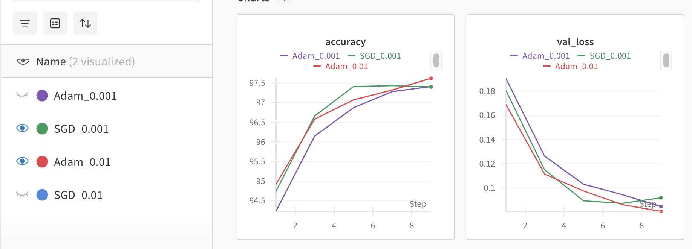

### Disclaimer
The code in this repo is generated by ChatGPT, and is used to learn the `wandb` library.

### Get familiar with wandb
start with with a simple demo in `param_search`

```
pip install -r requirements.txt
```

create `sweep`
```
wandb sweep param_search/sweep.yaml
```

Since I did not have a wandb account, I am prompted to sign up to get an API key from https://wandb.ai/authorize
After pasting the API key as required in terminal, I successfully created sweep with an `ID` and an external link to view sweep.

Now I am ready to run the sweep agent
```
wandb agent [ID]
```

### Fair comparison of optimizers
In `bench_optimizers`, use grid search for each optimizer.
In the result panel, I can choose only to view the best-performing param for each optimizer, like


### Distributed search
If multiple machines are available, I can still the same agent ID and run `wandb agent [ID]` on each machine.
The prerequisite is that you have wandb installed and logged on each machine.
Even under the same agent ID, the searched params are different and automatically controlled by wandb.

For a single machine with multiple GPUs, I can use `CUDA_VISIBLE_DEVICES` to allocate the tasks to different GPUs, like
```
CUDA_VISIBLE_DEVICES=0 wandb agent [ID]
CUDA_VISIBLE_DEVICES=1 wandb agent [ID]
CUDA_VISIBLE_DEVICES=2 wandb agent [ID]
CUDA_VISIBLE_DEVICES=3 wandb agent [ID]
```
